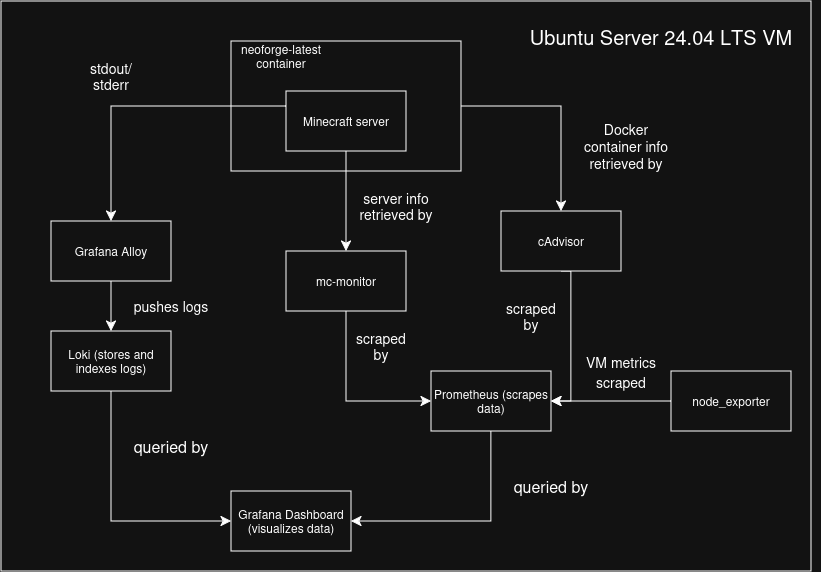

# Minecraft Server Observability Lab

A small observability lab I built around my personal Minecraft server.

The server runs NeoForge inside Docker on an Ubuntu Server 24.04 LTS VM hosted in Proxmox. You can read more about my homelab [here](https://cjones.dev/homelab)
I wanted some hands-on experience with observability tooling, so I set up a stack using Prometheus, Grafana, Loki, Alloy, cAdvisor, node_exporter, and mc-monitor.

Everything is managed with Docker Compose.

## Architecture



The stack collects data from a few different layers:

- **mc-monitor** exposes Minecraft-specific metrics such as server health, player count, and response time.
- **cAdvisor** provides Docker container metrics such as CPU and memory usage.
- **node_exporter** provides metrics for the Ubuntu VM itself.
- **Prometheus** scrapes and stores those metrics.
- **Grafana Alloy** collects the Minecraft container's logs and sends them to Loki.
- **Loki** stores and indexes the logs.
- **Grafana** queries Prometheus and Loki and displays everything in a dashboard.

## Dashboard

The Grafana dashboard currently shows:

- Server online/offline status
- Players online
- Minecraft container CPU usage
- Minecraft container RAM usage
- Server response time
- Minecraft server logs

## Stack

- Ubuntu Server 24.04 LTS
- Docker / Docker Compose
- NeoForge Minecraft Server
- Prometheus
- Grafana
- Loki
- Grafana Alloy
- cAdvisor
- node_exporter
- mc-monitor

## Ports

| Service | Port |
| --- | --- |
| Minecraft | `25565` |
| Grafana | `3000` |
| Loki | `3100` |
| Prometheus | `9090` |
| node_exporter | `9100` |
| mc-monitor | `8080` |
| cAdvisor | `8081` |

## Running the Stack

Start the observability services with:

```bash
docker compose up -d
